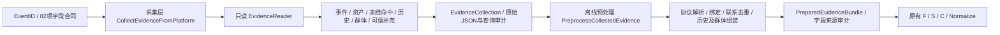

# 架构

```mermaid
flowchart LR
  A[EventID / 82项字段合同] --> B[采集层 CollectEvidenceFromPlatform]
  B --> C[只读 EvidenceReader]
  C --> D[事件 / 资产 / 冻结命中 / 历史 / 群体 / 可信补充]
  D --> E[EvidenceCollection / 原始JSON与查询审计]
  E --> F[离线预处理 PreprocessCollectedEvidence]
  F --> G[协议解析 / 绑定 / 联系去重 / 历史及群体组装]
  G --> H[PreparedEvidenceBundle / 字段来源审计]
  H --> I[原有 F / S / C / Normalize]
```

采集层负责读取和预算，预处理层负责确定性转换及完整性策略。平台原始记录在collection中保留，预处理可以断开平台后重放；它不执行取数，不把告警数量当作独立联系数量。

SQL入口使用已授权测试库的只读事务，隔离Fixture先装载平台行再冻结读取。正式报告入口尚未切换到该Provider；本实现没有新增采集节点或HTTP路由，也未实现通用TCP流重组。
