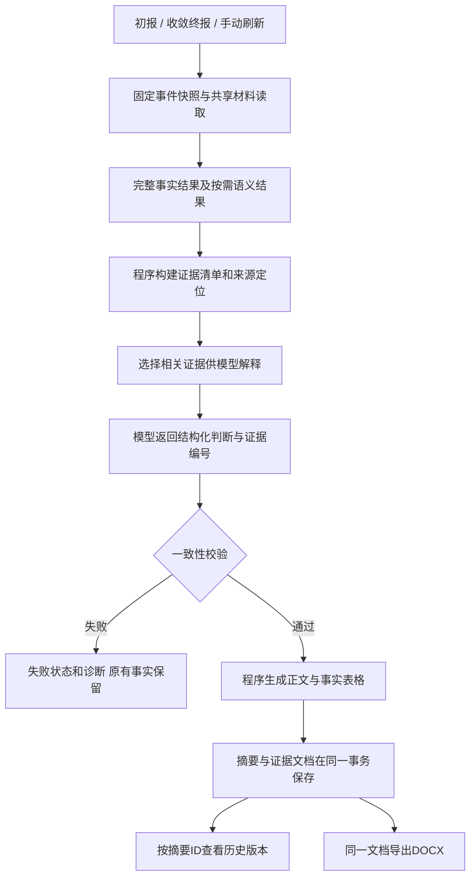

# 证据驱动的正式研判报告

## 本轮解决的问题

原来的报告让模型根据压缩后的上下文自由写正文，事实核验结果可能被遗漏，命中数可能被写成包数，缺材料可能被误写成“已经排除”，概率也缺少逐项依据。现在先由程序整理证据，再让模型解释证据与判断之间的关系。正文表格的事实、数值、来源由程序生成，模型不能改写。

正式报告顺序为：结论与概率 → 事件和资产概览 → 证据表格 → 支持、反向事实及替代解释 → 核查建议 → 核验概况。缺材料放入待补充信息和完整检查清单，不再把“限制”作为每条证据的主栏。

## 数据流程

`runAnalysis` 的三个入口共用这条链路。新文档格式为 `evidence-report-1.0`。事实与语义引擎本身保持原有职责，本轮没有新增打分引擎、外部情报同步或基线构建。

## 事实与概率如何绑定

- `ReportEvidenceBundle` 在模型压缩之前构建，保留完整事实检查、语义任务检查、来源、水位和快照版本。状态统计按规则与范围/槽位与命题计数，不保证恰好只有59行或23行。
- 正文最多选择12条、约6000字符的证据条目，优先成立事实，然后是通联观测、情报和语义解释，最后是相关的反向事实。未选中条目仍在保存的文档中，不能写成“算法没有执行”。
- 表格包含编号、证据项、核验结果、来源、研判意义。核验结果由程序从实际测量值生成。保存命中数明确写作保存命中数，报文片段只描述实际可见内容。
- 模型只输出结构化 `ReportAssessment`：判断命题、类型、阶段、概率、概率理由、支持/反向/替代依据、逐条解释及行动建议。支持和行动必须引用已送达的证据编号，每个选中条目必须有解释。
- 概率的命题固定为“本次通信属于恶意活动的可能性”，不代表主机失陷概率。它仍是模型研判估计，不是经过标注样本校准的统计概率；本轮不虚构权重或加减分公式。暂不能估计时返回 `null`，列表同步清除旧版概率。
- 反向依据只能使用实际充分核验的 `not_observed` 结果。`missing` 和正文省略均不能充当反向证据。同源情报、同族证据及已标为不可累加的事实/语义解释不允许重复贡献。

校验检查结构、引用、许可状态、重复贡献、数值改写和部分越界措辞；不能保证模型解释在语义上完全正确，也不能证明估计概率已经校准。这些需要真实模型和历史样本验收。

## 输入预算与失败处理

事实条目按整条选择，不能切断JSON。报告输入沿用约8500 token的数据预算和10000 token的总提示预算，使用已有估算器而非模型精确分词器，并额外限制60000 UTF-8字节。超出时逐项省略辅助上下文、对话、资产说明和可观察对象，显式记录省略标志，保持选中证据完整；仍超预算则失败。完整文档上限16 MiB，不默默截断来源。

模型响应最多64000字节；重复JSON键、额外根对象、未知字段、伪造编号、缺失解释、无依据的概率、越界数值、重复贡献和成功性越界结论会被拒绝。校验失败写入 `report_validation_failure`，关联事件及快照，保存原因码、格式版本和时间，不保存原始模型回答到诊断。状态为 `failed`，不新增正式报告摘要。事实和语义缓存独立保留。

常见原因码包括 `report_schema_invalid`、`report_duplicate_key`、`report_threat_type_invalid`、`report_input_budget_exceeded`、`report_document_budget_exceeded`。传输或模型配置错误沿用原有 `pending / llm_config_required` 路径。

## 保存、查看和导出

摘要与证据文档在 `AggregationTransaction` 内一起保存。证据文档复用 `aggregate_records`，类别 `report_document`，键为 `eventID:summaryID`，只允许插入。无需新增数据库表。重复生成即使正文一样，也获得独立摘要ID，不能覆盖旧报告。

读取会校验事件、摘要ID、版本、类型及正文绑定，重新检查判断引用，并验证程序渲染的正文与保存正文一致。历史查看和导出不会重新运行证据算法或模型，也不会拿最新事件数据替换旧证据。

| 操作 | 集成后端 | 独立后端 |
| --- | --- | --- |
| 读取文档 | `GET /api/traffic/events/detail/:eventID/report` | `GET /api/events/detail/{event_id}/report` |
| DOCX导出 | 上述路径加 `/export` | 上述路径加 `/export` |

两种接口均沿用相应后端的登录机制。`summary_id` 可省略以读取最新摘要，传入时必须是属于该事件的正整数ID。前端展示及导出始终传入选中版本的ID。

前端正文与完整核验清单分开呈现，来源入口按报告的固定快照查看实际命中。聊天和分析过程放在可展开区域，不再混入正式导出。DOCX是真正的OOXML文档，使用A4、中文字体、表格重复表头和单独的完整检查附录，文件不含聊天日志。来源附录列出快照水位、实际核验窗口与范围；每条证据展示前8个来源定位标识并注明总数，完整来源保存在证据文档中。

旧报告只有原正文、没有绑定的证据文档时，界面明确标注历史报告，保留查看，不能作为新版证据报告导出。需要手动刷新产生新版，不批量重算历史数据。

## 已完成的验证与仍需验收的内容

自动测试覆盖完整事实清单保留、预算下证据不丢失、伪造编号和数字拒绝、事实/语义重复贡献拒绝、无行为依据的强结论拒绝、模型错误不发布、事务回滚、不可覆盖保存、跨事件隔离、固定历史版本及DOCX的ZIP/XML结构和版式属性。初报、终报和手动刷新均通过本机模拟模型HTTP接口验证。

针对用户提供旧报告里的“58/59项未产出”“已排除周期通信”和“命中数被改写成包数/字节”等错误，加入了拒绝这些表述的回归测试。没有用该Word文件伪造原始报文来重跑算法。

尚需在真实数据库、本地实际模型上生成报告，检查判断质量、严格结构化输出通过率、概率是否合理，并人工查看Word及页面效果。180服务器未完成部署。本机模拟接口与结构测试不等同于生产效果验收。
