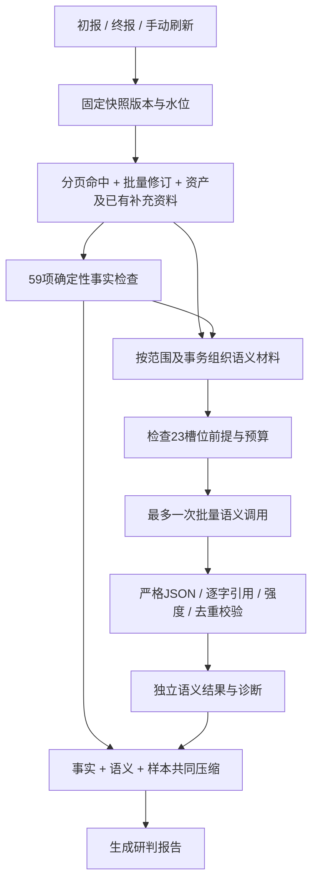

# 报告语义证据接入

已实现此前确定的1–6步。报告生成时先计算程序事实，再让本地模型解释满足条件的材料，校验后合入报告。不是把全量证据库JSON塞给模型，也不是让模型替代事实计算。真实事件与真实模型效果验收留在后续验证阶段。



## 六步落地

1. 共享输入：快照首次读取时同时提取事实输入和语义观察，不再为每个槽位查询数据库。事实缓存命中、语义材料缓存缺失时才补一次分页读取。
2. 原文模式：报告默认 `raw`，材料保留实际内容并明确 `Redacted=false`。引擎仍支持原有 `redacted` 契约，但本轮没有实现字段级脱敏；不能只改标志声称材料已脱敏。
3. 材料组织：按真实资产、设备、端点、窗口分隔；独立请求具有独立命题。HTTP请求/应答需实际事务及TCP序列核验，Stratum还需JSON ID匹配；DNS完整性需实际报文核验。单层hex/base64/base64url解码会验证每步实际字节，不执行载荷。
4. 按需执行：检查所有23个复合槽位。默认最多8个任务、总输入12000 UTF-8字节（含系统指令）、单段512字节、输出2000 token / 16000字节、60秒超时。执行顺序优先凭据结构、真实挖矿交互、双向协议交互，再解释词形、背景与缺口。S12、S13分别按两个子项检查。预算是上限，不保证凑满8项。
5. 校验与存储：禁止虚构材料和引用；强度不能超过程序许可值。同命题阳性解释去重，与事实标记不可累加。模型失败、非法回答不覆盖59项事实，也不作为可复用成功缓存；下次报告生成可重试。
6. 报告整合：三个入口共用准备流程。最多4条语义摘要，再按1800字符预算减量；事实摘要最多2400字符；与统计和样本共同受6000字符JSON预算约束，优先保留关键事实和已校验解释。省略整条记录或注明摘录裁剪，完整结果留在独立存储。最终提示继续压缩时也不会切断JSON。

一次报告最多增加一次语义批量调用，随后执行原有报告调用；健康检查沿用原逻辑。语义缓存命中时无需再次语义调用。材料检查不调用LLM。

## 条件、预算与异常的区别

| 情况 | 记录 | 含义 |
| --- | --- | --- |
| 缺正文、缺核验方向、缺同事务应答、缺独立资料 | `skipped` + 具体前提原因 | 无法解释此命题；不代表行为不存在 |
| 材料齐备但任务数或输入预算已满 | `skipped` + `task_budget_exceeded` / `context_budget_exceeded` | 本次未执行，不是阴性证据 |
| 模型未配置、超时、传输失败、漏任务 | `unavailable` | 执行不可用，可以后续重试 |
| 引用伪造、字段非法、强度越界 | `rejected` | 返回结果不能用于报告 |
| 引用及强度通过 | `accepted` | 待复核的模型解释；不等于判断正确或攻击成功 |

最终摘要分别提供 `missing_prerequisites`、`budget_not_executed`、`unavailable`、`rejected`。执行计数按“槽位×命题”，可以超过23；23是槽位目录数。

语义材料提取独立上限为128条观察、2MiB总材料、32KiB单报文，超过时记录 `semantic_material_budget_exceeded` / `semantic_message_budget_exceeded`，事实计算仍使用原本完整输入。事实读取本身失败时，语义明确不可用，不从模型摘要重建数据。

## 当前材料覆盖边界

| 现有资料 | 能支持的材料 |
| --- | --- |
| 原始HTTP、DNS命中与注册资产 | 请求、方向、UA、域名、词形背景、实际字段名、请求体、实际体积、Host |
| 同事务及TCP序列可核验的应答 | HTTP双向片段、HTML页面、挖矿请求/应答及配对 |
| 实际可逆编码值 | 解码链、解码明文及所属请求/域名；不猜多层解码 |
| 已存在并核验的补充来源 | 品牌授权、授权任务背景、明确角色、已裁决历史、已核验群体成员 |
| 快照与事实清单 | 可见性和信息缺口 |

23槽位都已接入前提检查，但并不保证每次都有材料触发。现有适配器未自动构建敏感内容分类、跨请求分块重组、业务日历/作息分布及完整品牌关系证明；涉及这些材料的任务保留缺项原因。历史只取同范围、当前窗口之前、具有独立裁决来源的记录，不将旧LLM结论升级为权威定谳，不新增外部来源同步或正常基线建设。

## 缓存与排错

- `evidence_result`：原有事实结果。
- `semantic_materials`：绑定事实缓存键和快照的材料，事实本体不重复保存；原文模式下含原始内容。
- `semantic_result`：完整计划、实际送达片段、回答摘要哈希、通过校验的结果；仅全部计划任务成功时缓存。
- `semantic_diagnostics`：状态、各任务原因、预算和缓存状态，使用事件ID/快照版本关联，不放原文引用或驱动错误正文。

缓存键包含快照/事实版本、语义适配版本、输入模式、规则版本、实际上下文哈希、预算、模型连接配置及可选模型版本。返回缓存再次校验。缓存损坏重新计算；材料绑定损坏重建一次，并记录原因。传输错误不会把底层错误正文塞进模型上下文。

查询原有 `GET /api/traffic/events/detail/{eventID}/evidence-diagnostics?snapshot_version=N`，新增 `semantics` 返回语义诊断。该接口不重算、不调用模型。只读 `evidence-check` / `ValidateReportEvidence` 会输出语义计划，状态 `planned`、原因 `read_only_no_model_call`，不调用模型、不写缓存。

## 配置

```go
options := DefaultReportSemanticOptions()
options.Config.MaxTasks = 8
options.ModelVersion = "local-model-revision-1"
services.ReportSemantics = &options
```

`Disable=true` 可独立关闭语义。使用已有LLM客户端，`Services.SemanticModel` 可注入符合输出预算契约的适配器。显式选项应从默认配置复制；非法配置会诊断为 `semantic_config_invalid`。

输入字节/字符预算不是精确token预算。已保留 `CountTokens` 与 `MaxInputTokens` 扩展接口；使用精确限制时必须注入实际模型的计数器。本轮不新增tokenizer依赖。本地部署更新模型权重或自定义语义适配器时应更新 `ModelVersion`，避免复用旧解释。

## 本轮验证

使用内存Store和本机模拟HTTP模型验证共享读取、缓存复用、失败重试、预算与缺料区分、伪造引用拒绝、模型版本失效、原文模式及三个报告入口。没有调用真实模型或生产数据库进行效果验收。
