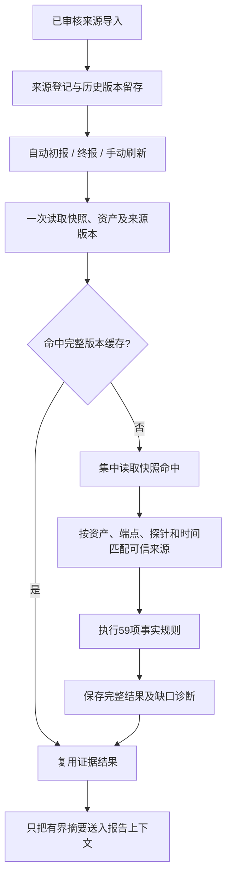

# 可信来源自动接入与真实事件验收

本次把“可信来源自动匹配”和“真实事件覆盖验收”接入报告共用流程。初报、收敛终报、手动刷新都经过 `runAnalysis → prepareReportInput → SnapshotEvidenceInput`。59 项事实共用一次原始命中读取，来源登记最多增加一次主键查询，不会变成每项算法各查一次库。

**实现接通，不等于现场数据已经齐全。** 当前代码会自动将已登记的可信资料转换成当前快照的输入；外部系统仍须提供真实、独立核验的资料。没有完整正常流量就不能训练正常基线，没有独立裁决就不能把报告审核状态当作恶意/误报。当前没有新增对外部工单、流量采集器、裁决系统的网络连接，也没有自动从告警库生成正常基线。

## 自动工作方式



`traffic_aggregation_records` 中新增两类记录，不需要建新表：

| 类型 / 键 | 用途 |
| --- | --- |
| `evidence_sources / active` | 当前可信来源登记，整个内容参与缓存身份 |
| `evidence_source_audit / 内容哈希` | 保留导入的历史版本；与 active 更新在同一事务内完成 |

登记的每项资料都有 ID、审核责任来源 `authority`、审核时间、完整 Scope 和有效窗口。禁止同范围的有效窗口重叠。禁止用资料登记替换当前 DNS/HTTP/连接/会话/TLS 实测记录。命中源按原流程读取。

可复用资料包括正常基线、历史独立裁决库、授权任务、审核品牌目录、服务与基础设施目录、DNS 词形语料、TLS 信任与指纹目录、独立规则/情报元数据。每个非空来源均要求 `Verified + Complete + Version + SourceIDs`。这是可信后端的核验契约，不能从探针或模型输出导入 `verified=true` 就宣称可信。

来源按精确 `AssetID + EndpointID + DeviceID` 匹配，不使用模糊 IP、资产类型、Remark 或近似参数推断授权。范围有效窗口必须覆盖该输入整个半开窗口。资产范围使用 `asset://资产ID`，不能拿某个端点的基线冒充整台资产基线。注册条目需要包含该范围全部可复用资料。

全局来源先合并，既有 `StoreSnapshotSupplemental` 精确快照资料后合并；同事实的基线由精确快照资料替换。当前阶段、战役证明、完整群体成员、当前会话及证书实测结果继续使用精确快照入口，避免把上次报告的证明复用到本次。

### 正常基线边界

登记基线时必须同时提供 `baseline_training`：独立来源证明、训练窗口、样本数（最低 30）、正常分类依据、`population=full_normal_flows`。训练必须在有效窗口开始之前结束。样本数量只是最低接入要求，不代表统计可靠性；各规则仍检查所需指标、比例与范围。基线指标由可信采集/校准系统提供，本模块不从只包含异常告警的命中记录中计算正常分母。

### 历史窗口边界

历史数据必须声明完整 `LookbackStart → AsOf`，事件 ID 不重复，时间在覆盖窗口内。恶意/误报记录还须有独立裁决 ID，来源仅允许 human、host_evidence 或 authoritative_external；其他只能明确登记为 unreviewed。

自动生产时把历史截到当前范围第一条命中之前，排除当前事件自身。只有原来源 AsOf 已覆盖这一截断点才能使用；旧库尚未覆盖的时段记录 `source_history_coverage_gap`，不会通过改时间伪造覆盖。阶段递进和历史协同的同 IOC/战役/完整成员核验仍由事实引擎执行。

## 运维入口

在后端目录运行，沿用项目 `config.toml` 或 `DATABASE_URL` 配置。不执行自动迁移，不调用模型。

```powershell
# 只读验收：有界抽取快照记录，逐事件检查最新版本。
# 没有快照时抽取最近旧事件，明确报告 legacy_snapshot_unverified。
go run ./traffic/cmd/evidence-check -sample 10 -output ../docs/evidence-validation-local.json

# 指定真实事件，冷计算，验证当前来源与实际规则覆盖。
go run ./traffic/cmd/evidence-check -event 实际事件ID -output ./evidence-check.json

# 这是显式写操作：导入已核验来源，替换 active 并保留历史版本。
go run ./traffic/cmd/evidence-check -import-sources ./audited-sources.json
```

最小授权来源示例（示例仅说明格式，不能当真实资料导入）：

```json
{
  "version": "audit-2026-10-09",
  "entries": [{
    "id": "approved-scanner-task",
    "authority": "实际工单审核来源",
    "approved_at": "2026-10-08T00:00:00Z",
    "input": {
      "scope": {"asset_id":"实际资产ID", "endpoint_id":"tcp://实际目标:443", "device_id":"实际探针ID"},
      "window": {"start":"2026-10-09T00:00:00Z", "end":"2026-10-10T00:00:00Z"},
      "authorizations": {
        "verified":true, "complete":true, "version":"真实来源版本", "source_ids":["实际工单ID"],
        "records":[{
          "id":"实际工单ID", "asset_id":"实际资产ID",
          "start":"2026-10-09T00:00:00Z", "end":"2026-10-10T00:00:00Z",
          "endpoint":"tcp://实际目标:443", "role":"scanner", "task_type":"scan",
          "ports":[443], "protocols":["https"], "targets":["实际目标"]
        }]
      }
    }
  }]
}
```

登记使用严格 JSON，拒绝未知字段、尾随内容、超过 2 MiB 的资料、超过 1024 项的范围、未审核/未核验来源和范围重叠。来源不可用不会制造反证。读取失败保留安全错误类型/代码，当前结果不缓存，下次重试；错误信息不导出驱动 SQL、密码或原始凭据。

## 验收结果如何读

`ValidateReportEvidence` 强制重新计算，走报告共用输入准备流程；不写缓存、不写诊断、不更新事件、不生成报告、不调用 LLM。JSON 输出全部 59 项的状态、范围、缺失原因、输入类别、来源版本、读取次数和耗时，不导出原始载荷或完整来源登记。

`reads` 统计 Store 调用次数，不冒充数据库驱动层的实际往返次数；每次命中读取包含结束检查的空页。规则多范围时会产生多条规则实例，状态统计不一定合计 59。样本按记录键取前 N 条并去重，验证对应事件最新快照；这是有界诊断样本，不是随机或全库覆盖率。输出 `evaluated_snapshot_events` 才是实际执行新流程的事件数量，`validated_events` 也包括明确降级的旧事件。

当前资产登记读取已支持 context、10 秒超时、扫描错误和 rows.Err 上报。旧 GetEvent/ListAssets 兼容接口仍不提供错误详情；验收 GetEvent 的失败只能记录为未找到/读取不可用，不能细分驱动故障。新快照流程使用带错误返回的资产读取方法。

### 2026-10-09 本机实测

连接项目配置的真实 `traffic` 数据库，未写入测试数据。检查到 7 个旧事件；原始命中表为空，没有不可变快照，也没有可信来源登记。7 个事件都返回 `unavailable / legacy_snapshot_unverified`，各有完整 59 项不可用记录。

因此本机完成了真实库连接、读取、旧事件降级与诊断验收，**新快照、真实补充来源和实际算法输出的现场验收尚未完成**。只有采集链路产生新命中/快照，并有独立资料登记后，才可以声明这部分通过。原始实测文件为 `docs/evidence-validation-local.json`。

回归测试另外覆盖自动初报/终报/手动刷新实际模型请求、来源生成的历史事实、热缓存无命中重读、来源内容变化失效、历史覆盖断档、导入拒绝、来源读取故障重试、只读验收无写操作。这些是实现测试，不代替现场验收。
